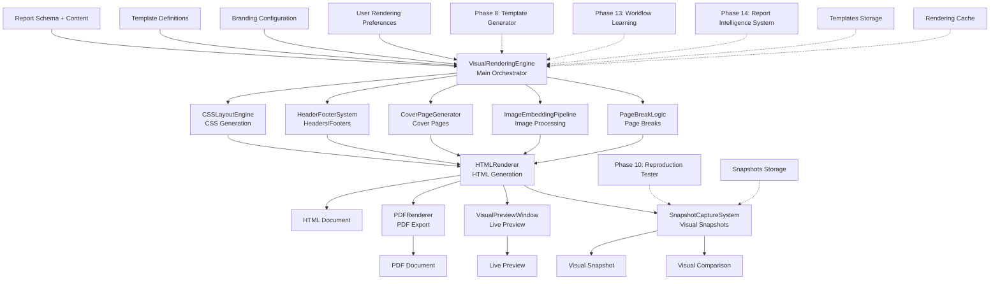
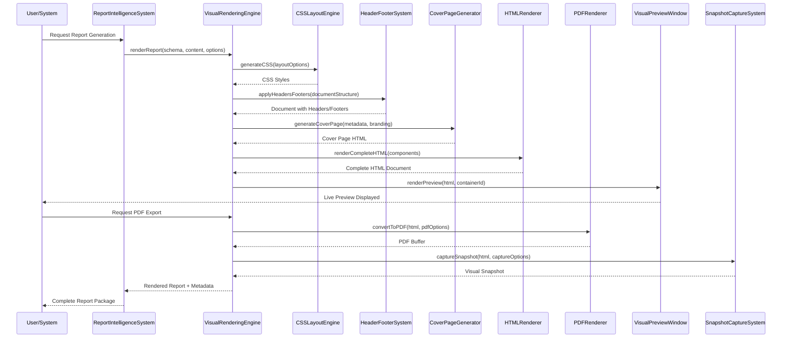
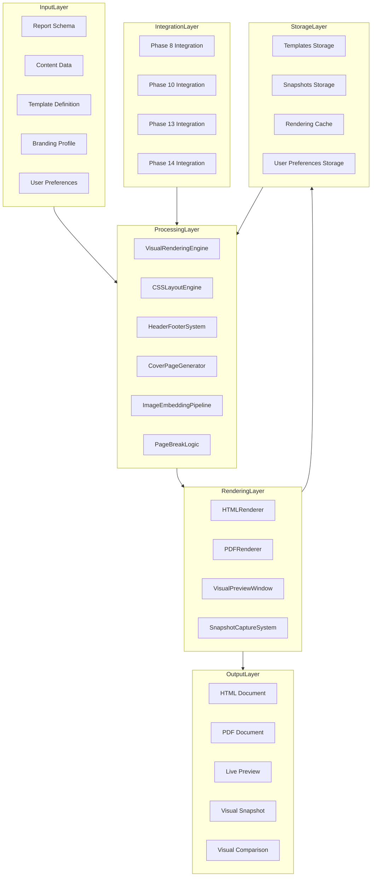
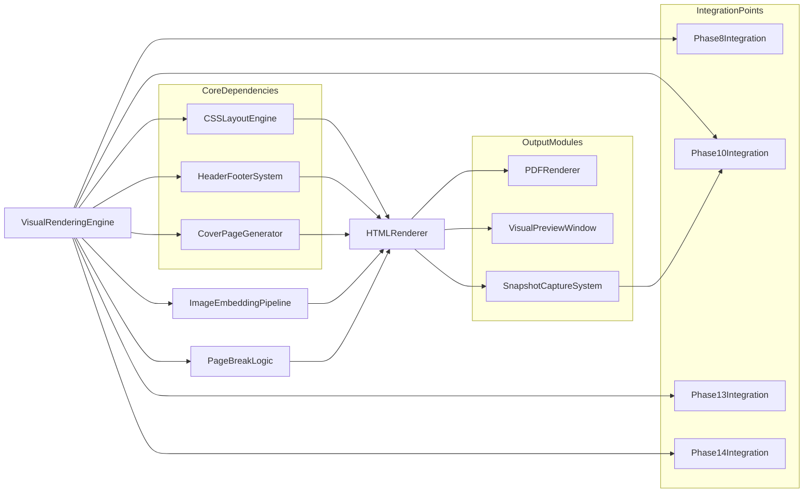
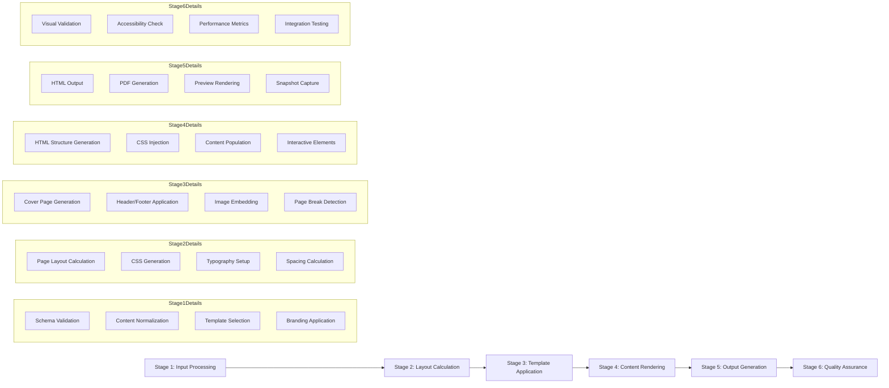
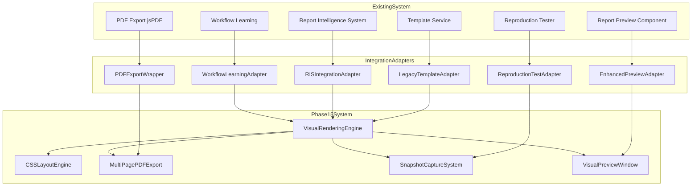
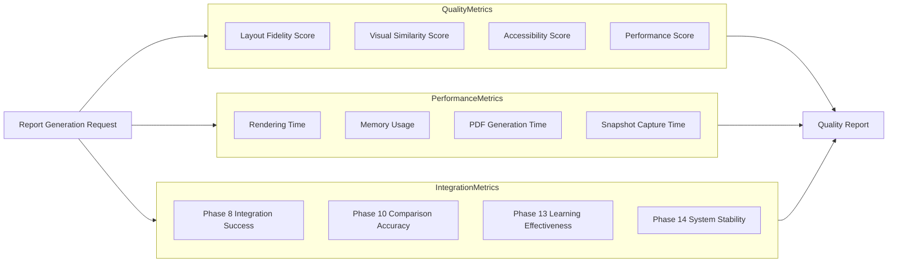

# Phase 15: HTML Rendering & Visual Reproduction Engine - Architecture Diagram

## System Architecture Overview



## Component Interaction Diagram



## Data Flow Architecture



## Module Dependency Graph



## Rendering Pipeline Stages



## Integration Architecture with Existing System



## Key Architectural Decisions

### 1. **Modular Design**
- Each engine is independently testable
- Clear separation of concerns
- Plug-and-play architecture

### 2. **Event-Driven Architecture**
- Rendering lifecycle events
- Integration hooks for other phases
- Real-time preview updates

### 3. **Caching Strategy**
- CSS generation cache
- Layout calculation cache
- Image optimization cache

### 4. **Fallback Mechanisms**
- Graceful degradation for unsupported features
- Multiple PDF rendering engines (jsPDF primary, Puppeteer fallback)
- CSS feature detection and polyfills

### 5. **Performance Optimization**
- Lazy loading of heavy components
- Incremental rendering for large documents
- Parallel processing where possible

### 6. **Quality Assurance**
- Visual snapshot comparison
- Automated accessibility testing
- Cross-browser compatibility checks
- Performance benchmarking

## Technology Stack Integration

```
Frontend (Browser):
  - HTML5/CSS3/JavaScript
  - Svelte components
  - jsPDF for client-side PDF
  - Canvas API for snapshots

Backend (Node.js if needed):
  - Puppeteer for server-side PDF
  - Image processing libraries
  - Headless browser for snapshots

Storage:
  - IndexedDB for browser storage
  - Local filesystem for workspace
  - JSON for configuration/templates

Integration:
  - TypeScript interfaces
  - Event emitters for communication
  - Promise-based async APIs
```

## Success Metrics Architecture



This architecture ensures that Phase 15 delivers a robust, scalable, and integrable visual rendering system that meets all requirements while maintaining compatibility with the existing 14-phase Report Intelligence System.