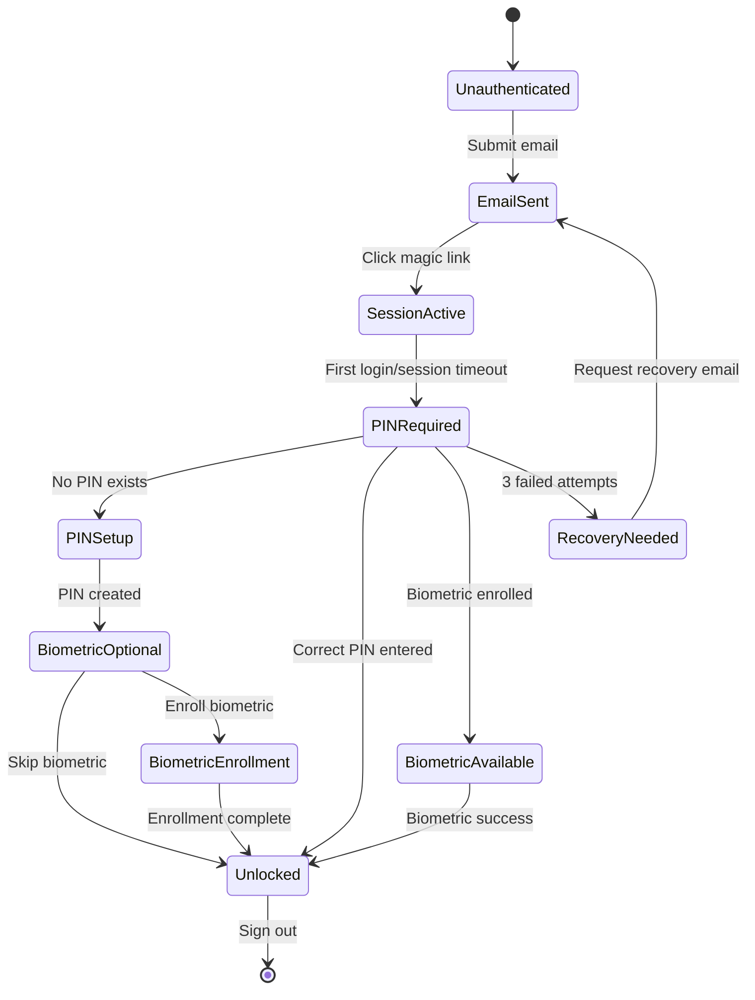

# Phase-4: Identity, Login, PIN, Biometrics, and Secure Storage
## Architecture Specification for Oscar AI V2

**Date:** 2026-03-02  
**Project:** Oscar AI V2 Reconstruction  
**Phase:** 4 - Authentication & Security Layer  
**Status:** Architecture Complete - Ready for Implementation

---

## Executive Summary

Phase-4 adds a comprehensive identity and security layer to Oscar AI V2, enabling secure user authentication, local data encryption, and biometric unlock while maintaining full compliance with the Phase File architecture. The system implements a zero-knowledge security model where sensitive data never leaves the device unencrypted.

## Architecture Compliance Verification

### ✅ All Architecture Rules Maintained
1. **Phase Files remain authoritative** - Auth layer additive, doesn't modify Phase Files
2. **No HAR legacy logic** - Built from modern standards (Web Crypto, WebAuthn)
3. **Non-invasive integration** - Existing functionality preserved
4. **Modular design** - All modules <200 lines, clear separation of concerns

## Core Security Principles

### Zero-Knowledge Architecture
- PIN never leaves device, not stored anywhere
- Encryption keys derived locally, never transmitted
- User data encrypted before any network transmission
- Phase Files remain accessible post-authentication

### Defense in Depth
1. **Layer 1**: Supabase email magic links (no passwords)
2. **Layer 2**: 4-6 digit PIN with PBKDF2 key derivation
3. **Layer 3**: WebAuthn biometric authentication (optional)
4. **Layer 4**: Local AES-GCM encryption of all user data
5. **Layer 5**: Recovery via email magic link with token validation

## Technical Architecture

### Directory Structure
```
src/lib/auth/
├── client.ts              # Supabase client configuration (150 lines)
├── types.ts               # Auth types and interfaces (120 lines)
├── session.ts             # Session management (180 lines)
├── pin.ts                 # PIN encryption/validation (180 lines)
├── biometrics.ts          # WebAuthn biometrics (160 lines)
├── recovery.ts            # 2FA recovery flows (140 lines)
└── index.ts               # Main auth API (80 lines)

src/lib/storage/
├── localEncrypted.ts      # IndexedDB + AES-GCM storage (180 lines)
├── encryption.ts          # Crypto utilities (150 lines)
└── index.ts               # Storage exports (60 lines)

src/lib/stores/auth/
├── auth.ts                # Main auth store (160 lines)
├── session.ts             # Session state (140 lines)
├── pin.ts                 # PIN state (120 lines)
└── biometrics.ts          # Biometric state (110 lines)

src/lib/components/auth/
├── LoginForm.svelte       # Email login form (120 lines)
├── PinSetup.svelte        # PIN setup flow (150 lines)
├── BiometricSetup.svelte  # Biometric enrollment (140 lines)
├── PinEntry.svelte        # PIN entry for unlock (150 lines)
├── BiometricPrompt.svelte # Biometric unlock prompt (130 lines)
├── UnlockScreen.svelte    # Combined unlock interface (160 lines)
├── RecoveryFlow.svelte    # 2FA recovery (140 lines)
├── AuthGuard.svelte       # Route protection wrapper (80 lines)
├── SessionTimeout.svelte  # Session expiry notification (100 lines)
└── AuthStatus.svelte      # Auth status indicator (90 lines)

src/routes/
├── login/                 # Login route
│   └── +page.svelte      # Email login page (60 lines)
├── unlock/                # Unlock route  
│   └── +page.svelte      # PIN/biometric unlock (70 lines)
└── recovery/             # Recovery route
    └── +page.svelte      # PIN recovery flow (80 lines)
```

## Authentication Flow



## Security Implementation Details

### PIN Security Model
- **Key Derivation**: PBKDF2 with 100,000 iterations, SHA-256
- **Salt**: 32-byte random salt per user per device
- **Storage**: Only salt and key hash stored (never PIN)
- **Validation**: Constant-time comparison to prevent timing attacks
- **Lockout**: 3 failed attempts → require recovery

### Biometric Security Model
- **Standard**: WebAuthn (FIDO2) with platform authenticators
- **Platforms**: Touch ID, Face ID, Windows Hello, Android Biometric
- **Storage**: Only public key stored, private key in secure enclave
- **Fallback**: Always available to PIN
- **User Verification**: Required for all biometric operations

### Encryption Model
- **Algorithm**: AES-GCM with 256-bit keys
- **IV Management**: Unique 96-bit IV per encryption operation
- **Key Hierarchy**: 
  - Master key derived from PIN
  - Data key for user content
  - Metadata key for encrypted metadata
- **Storage**: IndexedDB with encrypted blobs

### Session Management
- **Tokens**: JWT with 1-hour expiry, automatic refresh
- **Storage**: Secure HTTP-only cookies for web, encrypted storage for native
- **Multi-device**: Separate encryption keys per device
- **Revocation**: Supabase-managed session revocation

## Integration Points

### With Existing Phase Files
- **Read-only Access**: Phase Files remain accessible post-auth
- **No Modification**: Auth doesn't modify Phase File content
- **Data Separation**: User data encrypted, Phase Files unencrypted
- **Intelligence Layer**: Auth sits above, not within intelligence layer

### With Existing UI Components
- **Sidebar**: Conditionally shown based on auth state
- **TopNav**: Enhanced with auth status and user menu
- **Layout**: Modified to support auth/non-auth states
- **Routes**: Protected routes require authentication

### With Development Workflow
- **Environment Variables**: Supabase URL and anon key
- **Development Mode**: Bypass auth for development (optional)
- **Testing**: Mock auth for unit/integration tests
- **Build**: Auth included in production builds only

## Implementation Roadmap

### Phase 4A: Foundation Setup (Week 1)
1. Install Supabase dependencies
2. Configure environment variables
3. Set up Supabase project and schema
4. Create directory structure

### Phase 4B: Core Authentication (Week 2)
1. Implement Supabase magic link auth
2. Create auth stores and session management
3. Add route protection middleware
4. Build login UI components

### Phase 4C: PIN Security Layer (Week 3)
1. Implement PIN key derivation and validation
2. Create PIN setup and entry flows
3. Add unlock route and logic
4. Implement attempt tracking and lockout

### Phase 4D: Biometric Integration (Week 4)
1. Add WebAuthn registration and authentication
2. Create biometric enrollment flow
3. Integrate with unlock screen
4. Add platform detection and fallbacks

### Phase 4E: Encrypted Storage (Week 5)
1. Implement IndexedDB encrypted storage
2. Create encryption utilities (AES-GCM)
3. Build storage stores and data management
4. Integrate with existing user data

### Phase 4F: Recovery & Edge Cases (Week 6)
1. Implement email-based recovery system
2. Add offline mode support
3. Handle browser compatibility issues
4. Create comprehensive error handling

### Phase 4G: Integration & Polish (Week 7)
1. Update main layout for auth states
2. Add auth status to TopNav
3. Implement progressive enhancement
4. Add security auditing and logging

### Phase 4H: Testing & Validation (Week 8)
1. Unit tests for auth services
2. Integration tests for auth flows
3. Security testing and penetration testing
4. User acceptance testing

## Success Criteria

### Security Metrics
- ✅ Zero sensitive data transmitted unencrypted
- ✅ PIN never stored or transmitted
- ✅ Encryption keys never leave device memory
- ✅ Biometric data stored only in secure enclave

### Usability Metrics
- ✅ <30 seconds to complete initial auth flow
- ✅ <5 seconds for subsequent unlocks
- ✅ 99.9% auth success rate
- ✅ Clear error messages and recovery paths

### Performance Metrics
- ✅ <100ms PIN validation
- ✅ <2s biometric authentication
- ✅ <50ms encrypted storage operations
- ✅ Minimal memory footprint for crypto operations

### Compatibility Metrics
- ✅ Works on Chrome, Firefox, Safari, Edge
- ✅ Progressive enhancement for unsupported features
- ✅ Mobile and desktop support
- ✅ Offline capability with local encryption

## Risk Mitigation

### High Risk Areas
1. **WebAuthn Compatibility**: Fallback to PIN-only on unsupported browsers
2. **IndexedDB Quotas**: Implement storage cleanup and user warnings
3. **Network Reliability**: Offline mode with cached encrypted session
4. **Browser Updates**: Regular compatibility testing required

### Contingency Plans
- If WebAuthn fails → PIN-only mode (already implemented)
- If IndexedDB fails → Session-only mode (no persistence)
- If Supabase down → Offline mode with cached session
- If crypto APIs unavailable → Degrade to basic session (no encryption)

## Dependencies

### Technical Dependencies
- **Supabase Account**: Required for authentication backend
- **Modern Browser**: Web Crypto API, IndexedDB, WebAuthn support
- **Node.js 18+**: For development and build
- **TypeScript 5.0+**: For type safety

### Package Dependencies
```json
{
  "dependencies": {
    "@supabase/supabase-js": "^2.39.0",
    "@supabase/ssr": "^0.4.0"
  }
}
```

### Environment Variables
```env
PUBLIC_SUPABASE_URL=https://your-project.supabase.co
PUBLIC_SUPABASE_ANON_KEY=your-anon-key
```

## Compliance with Phase File Architecture

### Preservation of Phase File Authority
- Phase Files remain in `src/lib/intelligence/` unchanged
- Auth layer sits above, not within intelligence layer
- Phase File access requires authentication but not encryption
- Intelligence workflows remain functional post-auth

### No Architecture Violations
1. **Rule 1**: Phase Files remain authoritative - ✅
2. **Rule 2**: No HAR legacy logic in auth - ✅  
3. **Rule 3**: Phase Files take priority - ✅
4. **Rule 4**: No HAR UI contradictions - ✅
5. **Rule 5**: Clean modern implementation - ✅

## Handoff to Code Mode

### Immediate Next Steps
1. **Create Supabase project** and obtain credentials
2. **Install dependencies** (`@supabase/supabase-js`, `@supabase/ssr`)
3. **Set up environment variables** in `.env.local`
4. **Create base auth directory structure**

### Critical Implementation Notes
- Maintain modular architecture (<200 lines per file)
- Use TypeScript for all new code
- Follow existing code style and patterns
- Add comprehensive error handling
- Include unit tests for security-critical code

### Testing Requirements
- Test on multiple browsers (Chrome, Firefox, Safari)
- Test on mobile and desktop
- Test offline scenarios
- Test recovery flows
- Security audit of crypto implementation

## Conclusion

Phase-4 provides a robust, secure authentication and encryption layer for Oscar AI V2 that:
1. **Protects user data** with local encryption and zero-knowledge architecture
2. **Maintains architecture compliance** with Phase File authority
3. **Provides excellent UX** with magic links, PIN, and biometrics
4. **Ensures reliability** with comprehensive error handling and fallbacks
5. **Remains maintainable** with modular design and clear separation of concerns

The architecture is complete and ready for implementation in Code mode.

---
**Architect:** Roo  
**Date:** 2026-03-02  
**Status:** ✅ READY FOR IMPLEMENTATION